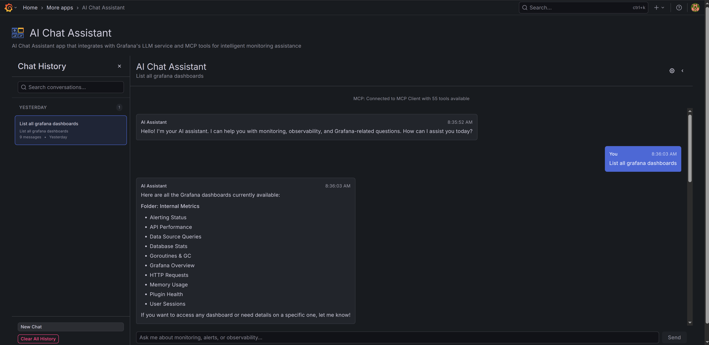

[](LICENSE)

# Grafana AI Chat Assistant

An intelligent chat interface for Grafana that leverages Large Language Models (LLMs) to provide interactive assistance with monitoring, observability, and system analysis.

## Quick Start

1. Install the plugin (see [Installation](#installation))
2. Restart Grafana
3. Navigate to Apps > AI Chat Assistant
4. Configure LLM provider in Administration > Plugins > LLM App
5. Start a new chat conversation

## Features

- **Interactive AI Chat**: Real-time streaming conversations with AI assistants
- **LLM Integration**: Works with OpenAI, Azure OpenAI, and other LLM providers via Grafana's LLM service
- **MCP Tool Integration**: Automatic tool calling with Model Context Protocol servers
  - Real-time tool execution tracking and status indicators
  - Support for multiple MCP servers
  - Ability to cancel long-running tool operations
- **Multi-Session Management**: Create, switch, rename, and delete chat sessions
- **Backend Persistence**: File-based storage with per-user isolation and configurable limits
- **Rich Message Display**: Markdown rendering with syntax-highlighted code blocks
- **Configurable Settings**: System prompts, session limits, and MCP toggle

## Screenshots



## Prerequisites

- **Grafana >= 10.4.0** with the LLM App plugin installed and configured
- **LLM Service Configuration**: API keys for OpenAI, Azure OpenAI, or other supported providers
- **Optional**: MCP Client plugin for enhanced tool capabilities

## Installation

### grafana-cli (Coming Soon)

Installation via grafana-cli will be available once published to the Grafana plugin catalog.

```bash
grafana-cli plugins install grafana-aichat-app
```

### Manual Installation

1. Download the latest release from GitHub
2. Extract to your Grafana plugins directory
3. Restart Grafana

### Docker/Kubernetes

Mount the plugin directory and configure in your deployment:

```yaml
volumes:
  - ./plugins/grafana-aichat-app:/var/lib/grafana/plugins/grafana-aichat-app

environment:
  - GF_PLUGINS_ALLOW_LOADING_UNSIGNED_PLUGINS=grafana-aichat-app
```

### Building from Source

**Prerequisites:**
- Go >= 1.24.1
- Node.js >= 18

```bash
git clone <repository-url>
cd grafana-aichat-app
npm install
npm run build
./scripts/build.sh
```

## Configuration

### LLM Service

**Via Provisioning (Recommended):**

```yaml
# grafana/provisioning/plugins/apps.yaml
- type: grafana-llm-app
  orgId: 1
  enabled: true
  jsonData:
    openAIConfig:
      provider: "openai"
      model: "gpt-4"
  secureJsonData:
    openai_apiKey: "${OPENAI_API_KEY}"
```

**Via UI:**

1. Navigate to Administration > Plugins > LLM App
2. Configure provider settings and API key
3. Test connection

### Chat Settings

Access via the gear icon in chat:
- **System Prompt**: Customize AI assistant behavior
- **Max Sessions**: Sessions per user (default: 10)
- **Max Messages**: Messages per session (default: 100)
- **MCP Integration**: Enable/disable tool calling

## Development

```bash
# Development build with watch mode
npm run dev

# Production build
npm run build

# Run tests
npm run test

# Run linter
npm run lint
```

### Backend Compilation

```bash
# Build for current platform
go build -o dist/gpx_grafana-aichat-app ./pkg

# Build for Linux/ARM64 (containers)
GOOS=linux GOARCH=arm64 go build -o dist/gpx_grafana-aichat-app ./pkg
```

See [MULTIPLATFORM-BUILD.md](./MULTIPLATFORM-BUILD.md) for multi-platform options.

## Architecture

- **Frontend (TypeScript/React)**: Chat interface, session management, settings
- **Backend (Go)**: REST API for persistence and session management
- **LLM Integration**: Via `@grafana/llm` library
- **MCP Integration**: Optional integration with MCP Client plugin

### Backend Features

- Session lifecycle API (CRUD operations)
- File-based storage with per-user isolation
- Rate limiting (10 req/sec, burst 20)
- Input validation and XSS protection
- Health check endpoints

## Troubleshooting

### Chat not responding

- Verify LLM service is configured in Administration > Plugins > LLM App
- Check API keys are valid with sufficient quota
- Check browser console (F12) for errors

### Plugin not visible

- Ensure plugin is installed and Grafana restarted
- Check Grafana logs for loading errors
- Verify plugin signing configuration

### MCP tools not available

- Install and configure MCP Client plugin separately
- Ensure MCP servers are running and accessible
- Verify MCP servers are enabled in configuration

## Security

- **API Keys**: Stored securely in Grafana configuration, supports environment variables
- **Chat History**: Per-user isolated storage with path traversal protection
- **Access Control**: Integrates with Grafana permissions
- **Rate Limiting**: Per-user limits prevent abuse
- **Input Validation**: XSS protection on all inputs
- **Data Privacy**: No data sent outside configured LLM provider

## API Documentation

See [docs/API.md](docs/API.md) for backend endpoint documentation.

## Contributing

See [CONTRIBUTING.md](./CONTRIBUTING.md) for development setup and guidelines.

## License

[Apache 2.0 License](./LICENSE)
